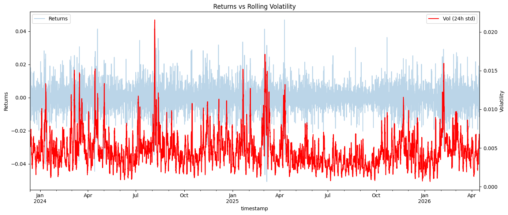
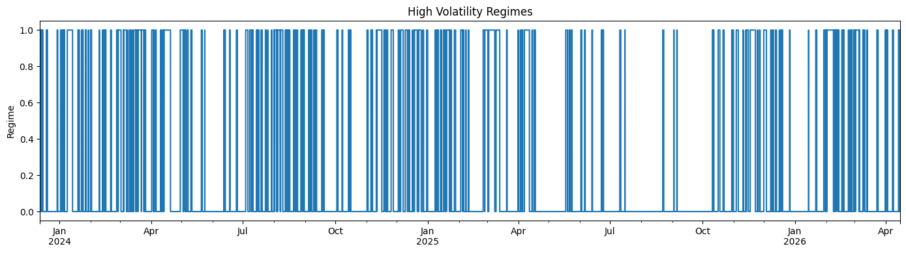
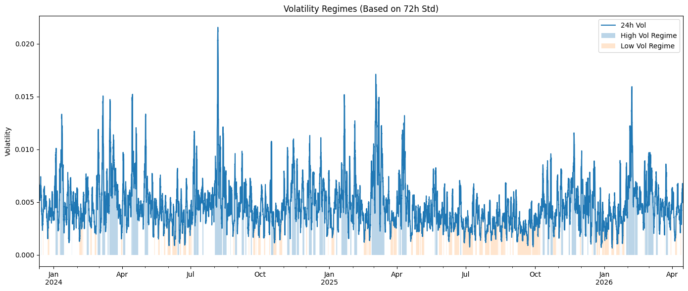
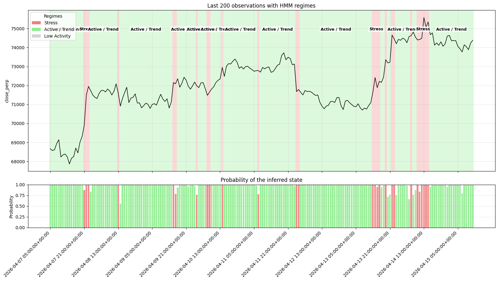
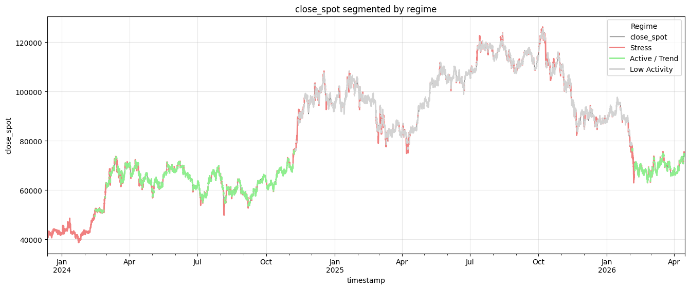
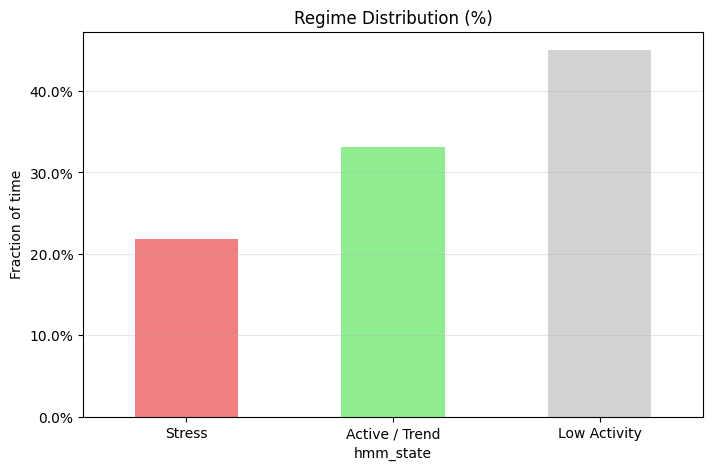

# Hidden Markov Regime Detection in Bitcoin Markets Using Deribit Spot-Perpetual Features

## 1. Abstract
This report documents the regime-detection results produced in the project notebooks only, without adding external post-processing statistics. The workflow uses Deribit market data, feature engineering, and Gaussian Hidden Markov Models (HMMs) to infer latent BTC market regimes. Notebook `00_data_preparation_and_feature_engineering.ipynb` constructs the engineered dataset and visualizes rule-based volatility regimes. Notebook `01_regime_detection_and_hmm_analysis.ipynb` performs candidate-feature search, selects a final HMM configuration, assigns semantic state labels, and evaluates persistence and confidence diagnostics. The notebook output reports a dataset shape of `(20521, 81)`, 17 candidate HMM features, and a selected 3-state model with features `['close_perp', 'volume_perp', 'abs_cost_perp']`. Reported diagnostics include selection score `2.284322`, state fractions `(0.218118, 0.331270, 0.450612)`, mean/median run lengths `(10.25, 3.00)`, transition matrix with dominant diagonals, average max posterior probability `0.9888`, and average entropy `0.0284`. The main contribution is a reproducible notebook-first research artifact that links market microstructure feature blocks to interpretable latent-state segmentation and stability diagnostics.

## 2. Introduction
Bitcoin derivatives regimes can shift quickly across volatility, liquidity, and directional pressure. These shifts are difficult to capture with static thresholds alone, especially when persistent latent states share similar headline volatility levels.

This project uses HMM-based latent-state modeling to separate persistent market conditions. The implementation emphasizes transparent feature engineering and interpretable diagnostics in notebooks, then supports modular reuse in `src/`.

Research contributions are:
- We provide a notebook-driven pipeline from Deribit data preparation to latent regime diagnostics.
- We evaluate many feature subsets with an explicit selection score balancing persistence, occupancy, and uncertainty.
- We report state persistence and confidence diagnostics directly from notebook outputs.

## 3. Literature Review
The study is motivated by volatility clustering and time-varying conditional variance in financial series (Engle, 1982; Bollerslev, 1986), and by latent-state regime models (Hamilton, 1989). Practical HMM estimation and interpretation are grounded in classic treatments of hidden-state inference (Rabiner, 1989; Bilmes, 1998). In digital asset markets, prior work documents microstructure frictions, volatility clustering, and derivatives-linked dynamics (Corbet et al., 2018; Makarov and Schoar, 2020), motivating multivariate state inference rather than single-indicator rules.

## 4. Dataset

### 4.1 Source
- Deribit public API data are used via repository ingestion utilities.
- Notebook artifacts:
  - `data/deribit_data.csv`
  - `data/deribit_enriched_data.csv`
  - `data/hmm_feature_selection_summary.csv`

### 4.2 Notebook-Reported Sample Snapshot
From notebook `01_regime_detection_and_hmm_analysis.ipynb`:
- Loaded dataset shape: `(20521, 81)`.
- Candidate HMM features used in search: `17`.

From notebook previews (`head()` displays):
- Data are indexed by UTC timestamps.
- The first shown timestamp is `2023-12-12 12:00:00+00:00`.

### 4.3 Variables and Cleaning
Notebook `00_data_preparation_and_feature_engineering.ipynb` and corresponding utilities construct return, volume, volatility, ATR, and cross-market structure features; the engineered dataset is saved and then consumed by notebook `01`.

### 4.4 Train/Test Logic
Notebook `01` uses repository split/search utilities (`make_time_splits`, `automatic_hmm_feature_selection`) as executed in notebook cells.

## 5. Methodology

### 5.1 Model Formulation
Let $x_t \in \mathbb{R}^d$ be standardized observed features and $z_t \in \{1,\dots,K\}$ latent regimes.

- Transition dynamics:
  $$
  \Pr(z_t=j \mid z_{t-1}=i) = A_{ij}
  $$
- Emissions:
  $$
  x_t \mid z_t=k \sim \mathcal{N}(\mu_k,\Sigma_k)
  $$
- Posterior probabilities:
  $$
  \gamma_{t,k} = \Pr(z_t=k \mid x_{1:T})
  $$
- Posterior entropy:
  $$
  H_t = - \sum_k \gamma_{t,k}\log(\gamma_{t,k}+\epsilon)
  $$

### 5.2 Selection Logic
Notebook `01` states and applies the project scoring formula:
$$
\text{score} =
3.0\cdot\text{avg\_self\_transition}
+1.5\cdot\text{min\_state\_fraction}
-0.25\cdot\text{median\_run\_length}
-2.5\cdot\text{avg\_entropy}
+0.05\cdot\text{loglik\_per\_obs\_per\_feature}
$$

Eligibility includes convergence and minimum state occupancy filtering as documented in notebook explanations.

## 6. Results (Notebook Outputs Only)

### 6.1 Descriptive Statistics Table (Notebook-Reported Diagnostics)

| Statistic | Value | Notebook Source |
|---|---:|---|
| Loaded dataset rows | 20521 | Notebook 01, dataset load output |
| Loaded dataset columns | 81 | Notebook 01, dataset load output |
| Candidate features in HMM search | 17 | Notebook 01, dataset load output |
| High-volatility threshold (75th percentile) | 0.005795 | Notebook 00, binary regime cell output |
| Mean run length | 10.25 | Notebook 01, run-length output |
| Median run length | 3.00 | Notebook 01, run-length output |
| Avg max posterior probability | 0.9888 | Notebook 01, posterior confidence output |
| Avg posterior entropy | 0.0284 | Notebook 01, posterior confidence output |

### 6.2 Model Comparison Table
Top configurations reported in notebook `01` summary output:

| Model (Feature Set) | States | Selection Score | Avg Self-Transition | Min State Fraction | Median Run Length | Avg Entropy |
|---|---:|---:|---:|---:|---:|---:|
| close_perp, volume_perp, abs_cost_perp | 3 | 2.284322 | 0.904622 | 0.264051 | 3.0 | 0.031536 |
| close_perp, volume_perp, abs_cost_perp, interest_8h | 3 | 2.109033 | 0.918380 | 0.289474 | 4.0 | 0.026897 |
| close_perp, volume_perp, std_24h_return_close_perp, abs_cost_perp | 3 | 2.107301 | 0.878426 | 0.228190 | 3.0 | 0.042590 |
| close_perp, volume_perp, log_volume_perp, std_24h_return_close_perp | 3 | 2.045207 | 0.851466 | 0.262288 | 3.0 | 0.046229 |
| close_perp, ma_24h_volume_perp, z_24h_volume_perp, abs_cost_perp | 3 | 2.038027 | 0.862318 | 0.247376 | 3.0 | 0.052381 |

### 6.3 Robustness Table (Notebook Alternatives)

| Configuration | Key Change | Selection Score | Interpretation |
|---|---|---:|---|
| Baseline | `close_perp, volume_perp, abs_cost_perp` | 2.284322 | Best composite score among shown alternatives |
| Add carry feature | `+ interest_8h` | 2.109033 | Similar persistence quality, lower overall score |
| Add short-horizon volatility | `+ std_24h_return_close_perp` | 2.107301 | Eligible and stable, but below baseline |
| Use transformed volume variant | `+ log_volume_perp` | 2.045207 | Maintains regime structure with weaker score |
| Alternate activity block | `ma_24h_volume_perp, z_24h_volume_perp` | 2.038027 | Robustly eligible, still below baseline |

### 6.4 Selected Model and Regime Occupancy
Notebook `01` selects row `0` with:
- Best features: `['close_perp', 'volume_perp', 'abs_cost_perp']`
- Number of states: `3`

Notebook regime-distribution output reports:
- State 0 fraction: `0.218118`
- State 1 fraction: `0.331270`
- State 2 fraction: `0.450612`

Transition diagnostics (Notebook `01`) show a diagonally dominant matrix:
- from_0 to_0: `0.832414`
- from_1 to_1: `0.931756`
- from_2 to_2: `0.949697`

## 7. Figures (Notebook Plots)

### Figure 1. Returns versus Rolling Volatility
Source: Notebook `00`, figure cell labeled “Figure 1. Returns versus rolling volatility”.

Interpretation: The notebook notes clustering of larger return moves with elevated rolling volatility, supporting the regime motivation.

### Figure 2. High Volatility Regimes (Binary)
Source: Notebook `00`, figure cell tied to `high_vol` label creation.

Interpretation: The binary series highlights when market conditions exceed the 75th-percentile volatility threshold.

### Figure 3. Volatility Regimes with 72-hour Shading
Source: Notebook `00`, figure cell labeled “Figure 3. Volatility regimes with 72-hour regime shading”.

Interpretation: The notebook explanation emphasizes persistent high/low regimes rather than isolated spikes.

### Figure 4. Recent HMM Regime Chart
Source: Notebook `01`, figure cell labeled “Figure 1. Recent HMM regime chart”.

Interpretation: Recent price action is segmented by inferred states, with posterior probability bars showing confidence by timestamp.

### Figure 5. Full-History HMM Regime Overlay
Source: Notebook `01`, figure cell labeled “Figure 2. Full-history HMM regime overlay”.

Interpretation: Regime colors highlight which latent states dominate specific historical market intervals.

### Figure 6. Regime Distribution Bar Chart
Source: Notebook `01`, figure section “Figure 3 / Statistic 9”.

Interpretation: State occupancy is materially distributed across states (no degenerate near-zero state usage).

## 8. Discussion
Notebook outputs indicate that the selected three-state model is both persistent and confident: diagonal transition probabilities are high, average max posterior probability is high, and entropy is low. This supports practical use for monitoring state shifts rather than relying only on single-threshold volatility rules.

Limitations visible from notebook-only evidence:
- Results are unsupervised and not yet tied to strategy-level PnL objectives.
- Diagnostics are in-sample workflow diagnostics; external benchmark comparison is not shown in notebook outputs.
- The report intentionally excludes statistics not explicitly produced by notebook cells.

## 9. Conclusion
Using only notebook-reported evidence, the project identifies a stable 3-state BTC regime structure from Deribit features. The selected feature subset (`close_perp`, `volume_perp`, `abs_cost_perp`) achieves the highest reported composite score and produces interpretable state occupancy, persistence, and confidence diagnostics. The notebook pipeline is a valid research artifact for latent-state analysis and a strong base for future out-of-sample strategy evaluation.

## 10. Appendix

### A. Notebook Artifacts Used
- `notebooks/00_data_preparation_and_feature_engineering.ipynb`
- `notebooks/01_regime_detection_and_hmm_analysis.ipynb`
- `data/hmm_feature_selection_summary.csv` (generated/used in notebook workflow)

### B. Citations
1. Engle, R. F. (1982). Autoregressive Conditional Heteroskedasticity with Estimates of the Variance of UK Inflation. *Econometrica*.
2. Bollerslev, T. (1986). Generalized Autoregressive Conditional Heteroskedasticity. *Journal of Econometrics*.
3. Hamilton, J. D. (1989). A New Approach to the Economic Analysis of Nonstationary Time Series and the Business Cycle. *Econometrica*.
4. Rabiner, L. R. (1989). A Tutorial on Hidden Markov Models and Selected Applications in Speech Recognition. *Proceedings of the IEEE*.
5. Bilmes, J. A. (1998). A Gentle Tutorial of the EM Algorithm and its Application to Parameter Estimation for Gaussian Mixture and Hidden Markov Models.
6. Corbet, S., Lucey, B., and Yarovaya, L. (2018). Datestamping the Bitcoin and Ethereum bubbles. *Finance Research Letters*.
7. Makarov, I., and Schoar, A. (2020). Trading and Arbitrage in Cryptocurrency Markets. *Journal of Financial Economics*.
